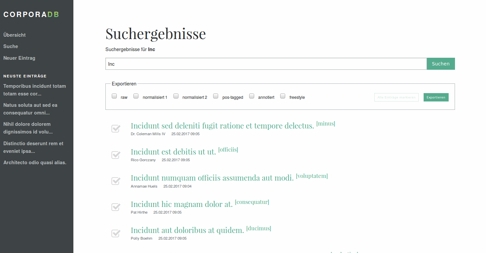

# CorporaDB

Database for collecting and refining corpus data. SQL database with web interface for users and API for direct SQL requests.



## Installation
~~~~~
git clone git@github.tik.uni-stuttgart.de:ac128227/db-corpora.git
composer install
php artisan migrate:install # initiate migrations
php artisan migrate # migrate predefined tables to database
php artisan storage:link # enable public file upload
php artisan serve
~~~~~

_`Composer` and `PHP` have to be installed previously._

## Development

### 1. Starting local web server

~~~~~{bash}
php artisan serve
# Laravel development server started: <http://127.0.0.1:8000>
~~~~~

### 2. Watch file changes for styles and scripts (SCCS, JS)

Automatically compile, uglify and bundle JS, CSS files and fonts.

~~~~~{bash}
npm run dev
# DONE  Compiled successfully in 4779ms
#
#                                                           Asset      Size  Chunks                    Chunk Names
#  fonts/fontawesome-webfont.eot?674f50d287a8c48dc19ba404d20fe713    166 kB          [emitted]         
#  fonts/fontawesome-webfont.svg?912ec66d7572ff821749319396470bde    444 kB          [emitted]  [big]  
#  fonts/fontawesome-webfont.ttf?b06871f281fee6b241d60582ae9369b9    166 kB          [emitted]         
# fonts/fontawesome-webfont.woff?fee66e712a8a08eef5805a46892932ad     98 kB          [emitted]         
#fonts/fontawesome-webfont.woff2?af7ae505a9eed503f8b8e6982036873e   77.2 kB          [emitted]         
#                                                      /js/app.js    857 kB       0  [emitted]  [big]  /js/app
#                                                    /css/app.css    991 kB       0  [emitted]  [big]  /js/app
#                                               mix-manifest.json  66 bytes          [emitted]         
#                                                js/jquery.min.js   86.7 kB          [emitted]         
#                                            js/foundation.min.js    149 kB          [emitted]         

~~~~~

## Configurations

~~~~~{bash}
cp .env.example .env # copy environment variables for productive usage
~~~~~

After copied `.env.example` to `.env` the environment variables are active. This file should not be versioned, because it contains database credentials etc. Inside the prefilled environment variables the database settings are configurated for a `Homestead` setup. You can also use an ordinary MySQL sever to hold your data.

## File Structure
As framework we are using Laravel 5.4 and serving from a self hosted server. For now this software is __heavily under construction__.

~~~~~
.env ----------------| stores database credentials etc.
app/ ----------------| main application files
  Http/ -------------| processing http requests
    Controllers/ ----| main controllers for application
    Provides/ -------| connecting routes with controllers
config/ -------------| general configurations
database/ -----------| database settings
  factories/ --------| generating automated seeds for database
  migrations/ -------| creating new database tables
  seeds/ ------------| automatically fill database
public/ -------------| distributed folder (DO NOT CHANGE MANUALLY)
resources/ ----------| resources necessary for the front end only
  lang/ -------------| translations for system wide notifications etc.
  views/ ------------| blade (template engine) files
    components/ -----| partial templates for extending inside layout files
routes/ -------------|
  web.php -----------| stores routes for browser requestes
~~~~~

## Optional: Enabling Git Hooks

To provide all markdown files also as human readable PDF files use the following `git-hook`:

```bash
  rm -rf .git/hooks && ln -s ../.hooks .git/hooks
```

## Authors

Michael Werner Czechowski (Planning, Programming):
<mail@dailysh.it>

Claus-Michael Schlesinger (Planning, Coordinator):
<claus-michael.schlesinger@ilw.uni-stuttgart.de>

## License
This software is distributed under GNU GPL.
